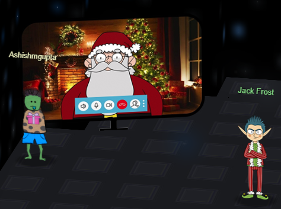

It may not be intended but the plot of the storyline of Kringlecon 4 looks similar to the plot of the movie “The Nightmare Before Christmas” where the main protagonist of the movie Jack Skellington Jack does not understand the true spirit of Christmas and wants to impersonate Santa Claus to give the holidays a macabre makeover. 
In this edition, Jack Frost organizes his own FrostFest just like Santa’s Kringlecon. 
Next to Santa’s tower, he builds his own tower with his studio, Office, Talks lobby, Frostavator very similar to Santa’s building. Hilariously, he also had a plan to offer clerical job. 

However, by talking to the elves and Jack’s own associates and getting hints from them, we were able to solve every objective and ultimately could send the message to the Planet Frost.  

Upon getting our message, Planet Frost’s folks arrive in a space ship on the Jack’s tower’s rooftop.
Buttercup, the princess of Planet Frost promises us that they would take Jack back home and bring him and any guilty trolls to justice for their infractions. 
 
But the report is not complete without a selfie with Santa and Jack Frost. 

This concludes the report. Hope you enjoyed it! 😊