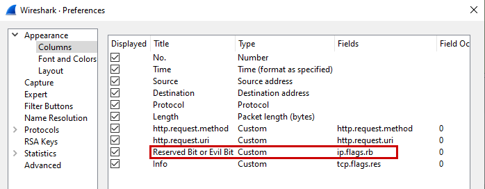
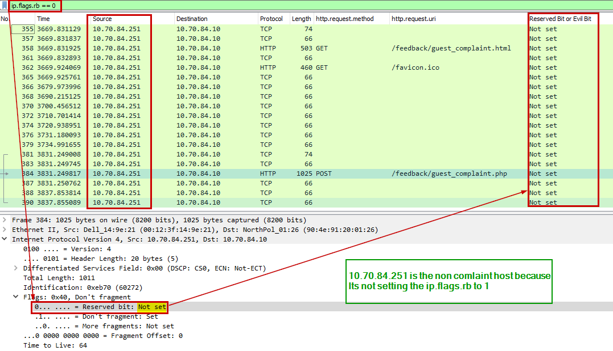
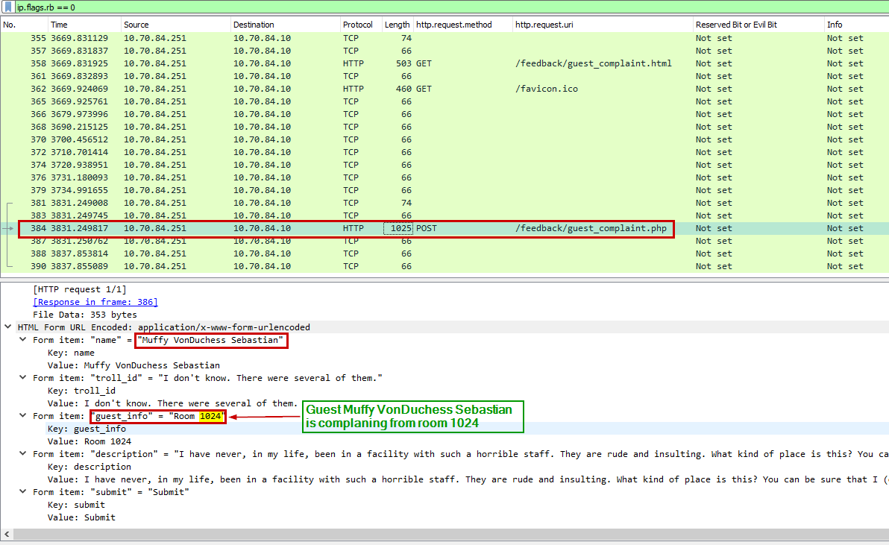
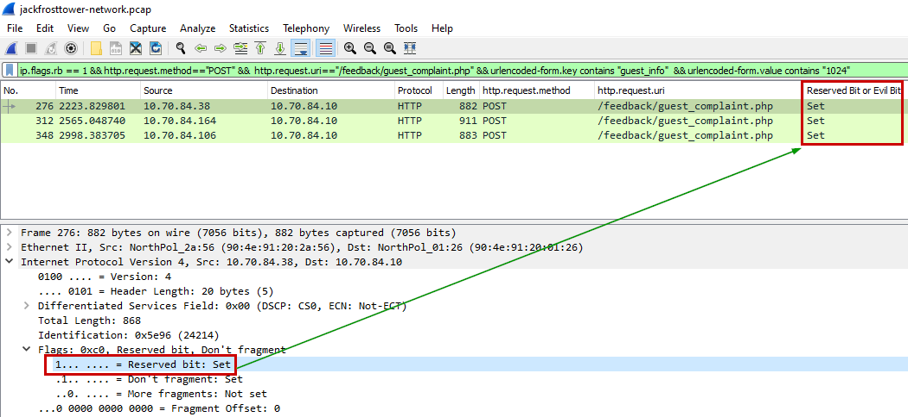
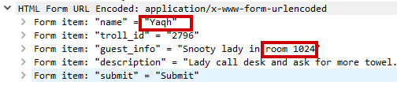
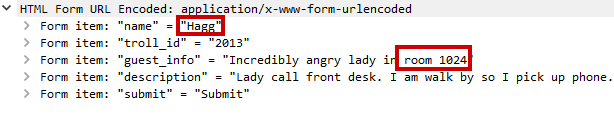

<table border=1px>
<tr>
    <td colspan=3>
    <b>Challenge : </b> <br>
    A human has accessed the Jack Frost Tower network with a non-compliant host. <br>
    Which three trolls complained about the human? Enter the troll names in alphabetical order separated by spaces. <br>
    Talk to Tinsel Upatree in the kitchen for hints.
    </td>
</tr>
<tr>
    <td>
    <b>Difficulty Level : </b> <br>
    <br>
    </td>
    <td>
     <b>Location : </b> <br>
    Jack’s Tower Talks Lobby                                          
    </td>
    <td>
    <b>Elf/Troll : </b> <br>
    Pat Tronizer <br>
    </td>
</tr>
</table>

<table>
<tr>
    <td>
    
    </td>
    <td>
        <b> Pat Tronizer </b> <br>
        I cannot believe an actual human connected to the Tower network. It’s supposed to be the domain of us trolls and of course Jack Frost himself.<br>
        Mr. Frost has a strict policy: all devices must be RFC3514 compliant. It fits in with our nefarious plans. <br>
        Some human had the nerve to use our complaint website to submit a complaint!<br>
        <b>Note:</b><br>
        <a href="https://downloads.jackfrosttower.com/2021/jackfrosttower-network.zip" target=_blank>https://downloads.jackfrosttower.com/2021/jackfrosttower-network.zip</a> has a pcap file which we will analyze to get the answer for this objective.
    </td>
<tr>
</table>

#### Understanding the RFC 3514
If we look at the RFC which is about a security flag in IPv4 header. <br>

<a href="https://datatracker.ietf.org/doc/html/rfc3514" target=_blank>https://datatracker.ietf.org/doc/html/rfc3514</a>

>"Benign packets have this bit set to 0; those that are used for an attack will have the bit set to 1"


#### Reading the evil bit/flag in the PCAP file
How can we read this reserved flag in the pcap via Wireshark? <br>
If we look at the Wireshark packet dissector page on Github, its <b>ip.flags.rb</b><br>


<a href="https://github.com/wireshark/wireshark/blob/master/epan/dissectors/packet-ip.c" target=_blank>https://github.com/wireshark/wireshark/blob/master/epan/dissectors/packet-ip.c</a>


 Armed with this information, we add the custom column for the Reserved/Evil bit based on "ip.flags.rb". <br> 
 We also add http.request.method and http.request.uri.



Now, Mr. Frost is evil and if he has the strict policy all the devices RFC 3514 compliant, they all be sending that flag set to 1 (ip.flags.rb = 1). <br>
Let's check which device is sending NOT compliant i.e., sending ip.flags.rb == 0. <br>



We look at the data posted via /feedback/guest_complaint.php. <br>
We see Muffy VonDuchess Sebastian is complaining about the hotel staff from room 1024.



#### Find complaininig trolls
Now let's find out which trolls are complaining about the guest. <br>
What information we can use to inspect the packet: 

<ol>
    <li>Trolls must be complaint to RFC 3514 so ip.flags.rb ==0.</li>
    <li>Trolls must be sending the complaint via the feedback form /feedback/guest_complaint.php</li>
    <li>Tolls must be complaining about the room 1024.</li>
</ol>

Wireshark query <br>
```
ip.flags.rb == 1 && http.request.method=="POST" &&  http.request.uri=="/feedback/guest_complaint.php" && urlencoded-form.key contains "guest_info"  && urlencoded-form.value contains "1024"
```


So now, we look at each of those 3 packets picking up the names of the trolls complaining about the guest in room 1024. <br>

<table>
    <tr>
        <td><b>Row #276 (Yaqh)</b></td>
    </tr>
    <tr>
        <td></td>
    </tr>
    <tr>
        <td><b>Row# 312 (Flud)</b></td>
    </tr>
    <tr>
        <td></td>
    </tr>
    <tr>
        <td><b>Row# 384 (Hagg)</b></td>
    </tr>
    <tr>
        <td></td>
    </tr>
</table>

We submit the above as the answer for the objective and the objective is now complete. <br>
<td></td>