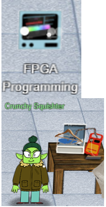
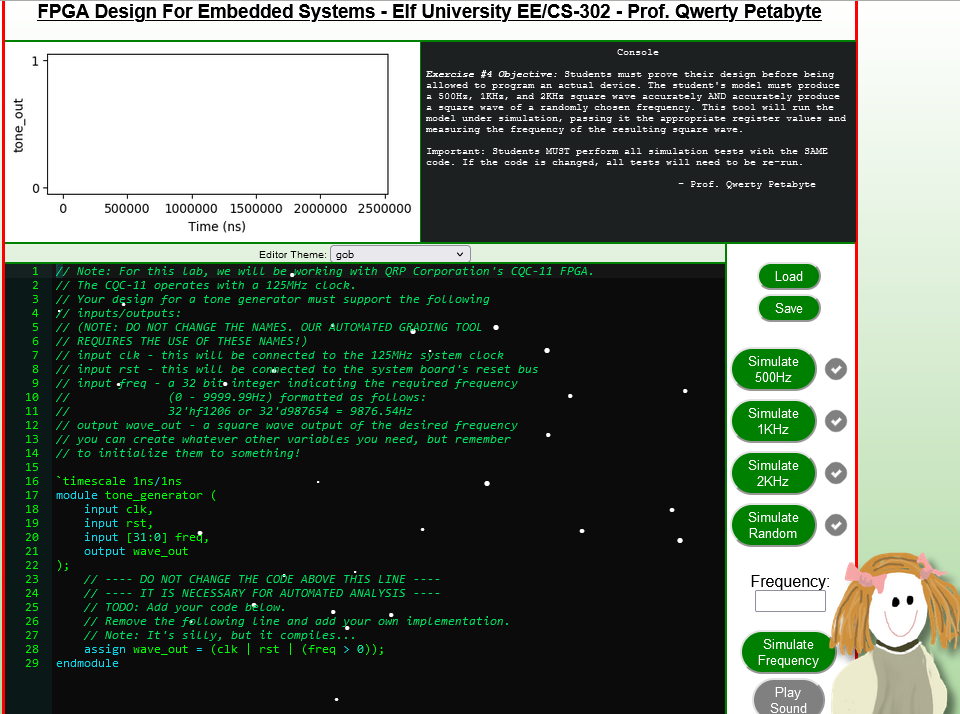
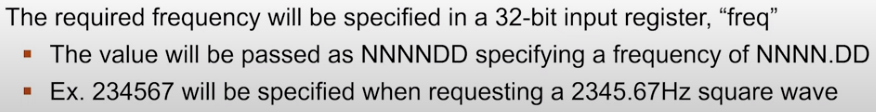
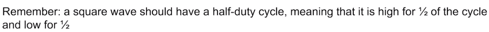
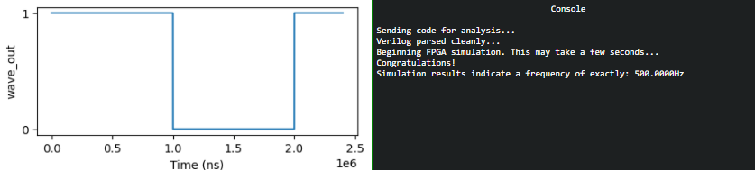
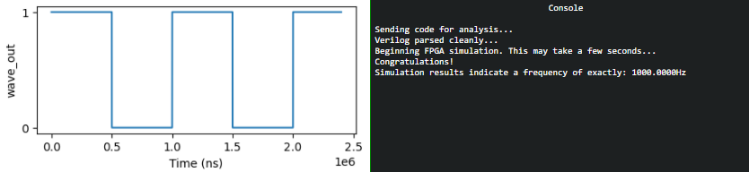
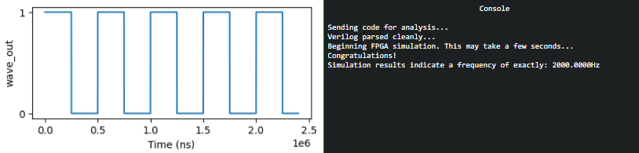
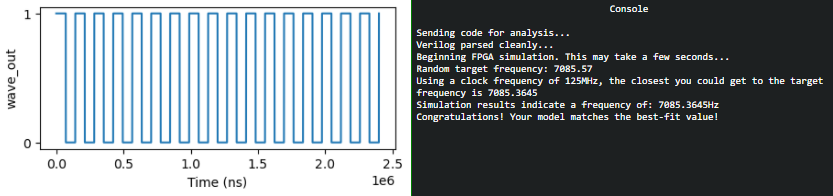
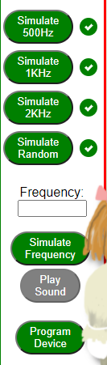
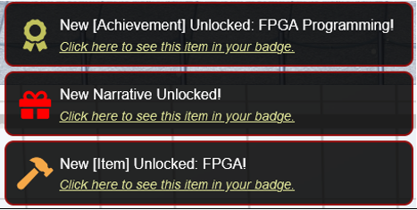

<table border=1px>
<tr>
    <td colspan=3>
    <b>Challenge : </b> <br>
    Write your first FPGA program to make a doll sing. You might get some suggestions from Grody Goiterson, near Jack's elevator..
    </td>
</tr>
<tr>
    <td>
    <b>Difficulty Level : </b> <br>
    <br>
    </td>
    <td>
     <b>Location : </b> <br>
    Frost Tower Rooftop                                                                                                                
    </td>
    <td>
    <b>Elf/Troll : </b> <br>
    Crunchy Squishter <br>
    </td>
</tr>
</table>

<table>
<tr>
    <td>
    
    </td>
    <td>
        <b> Crunchy Squister </b> <br>
        Hey, could you help me get this device on the table working? <br>
        We've cobbled it together with primitive parts we've found on your home planet.<br>
        We need an FPGA though - and someone who knows how to program them.<br>
        If you haven't talked with Grody Goiterson by the Frostavator, you might get some FPGA tips there <br><br>

        <b>Hints from Grody Goiterson : </b><br>
        1) First, did you know there are people who do <a href="https://www.fpga4fun.com/MusicBox.html" target=_blank>this stuff for fun</a>??<br>
        2) Prof. Petabyte guy is giving a <a href="https://www.youtube.com/watch?v=GFdG1PJ4QjA"  target=_blank>talk</a> about FPGAs.<br><br>
        <b>Hints from Prof. Qwerty Petabyte : </b><br>
        If $rtoi(real_no * 10) - ($rtoi(real_no) * 10) > 4, add 1 
        </br>
    </td>
</tr>
</table>

Clicking on the terminal opens. <br>
We see a boilerplate Verilog code with a module with 3 inputs (clk, rst and freq) and one output (wave_output). <br> 
That wave_output is assigned to wave_out which must be associated to a hardware to produce the sound.<br>
<a href="https://www.youtube.com/watch?v=GFdG1PJ4QjA"  target=_blank>talk</a> by Prof. Qwerty explains this very well. <br>



#### Approach

Per Prof. Qwerty, we need to create a square tone - meaning create a square wave output which takes our clock signal and uses a counter to divide the clock to match the desired frequency.<br>

The desired frequency is what is being sent when we click on the buttons “Simulate 500Hz”, “Simulate 1KHz”, “Simulate 2KHz” to send 500Hz, 1KHz and 2KHz frequency to the Verilog program shown in the right-hand side. Clicking on “Simulate Random” sends random frequencies to the program.


There is also a note from Prof. Qwerty Petabyte about the frequency specified will always be in NNNN.DD format. <br> 
So, to be accurate (as much as we can) we need to keep the data type as “real” instead of “integer”. Its also stated square wave should have a half-duty cycle. <br>
So, we create a new real variable for frequency to account for these and divide by 50.<br>
```
real freq_real = freq / 50;
```



<b>The rounding (hint from Prof. Qwerty):</b>

>One tricky problem that we'll encounter is that Verilog (v1364-2005) doesn't have a built-in mechanism to round real numbers to integers,
>so you'll need to devise a means to do that correctly if you want your module to match frequencies accurately.
>Good luck and always remember:
>If $rtoi(real_no * 10) - ($rtoi(real_no) * 10) > 4, add 1

We first calculate the adjustment value and later check if Its greater than 4. <br>

```
integer adjust = $rtoi(tone_real * 10) - ($rtoi(tone_real) * 10);
```

We initialize the a variable named “counter” with 32 bit value. <br>

Every time our 125MHz goes high <b>[always @(posedge clk)]</b> and the counter reaches the 32 bit value, we toggle the wave and assign the 
counter variable the integer value of the tone.

#### Complete Program
```
// Note: For this lab, we will be working with QRP Corporation's CQC-11 FPGA.
// The CQC-11 operates with a 125MHz clock.
// Your design for a tone generator must support the following
// inputs/outputs:
// (NOTE: DO NOT CHANGE THE NAMES. OUR AUTOMATED GRADING TOOL
// REQUIRES THE USE OF THESE NAMES!)
// input clk - this will be connected to the 125MHz system clock
// input rst - this will be connected to the system board's reset bus
// input freq - a 32 bit integer indicating the required frequency
//              (0 - 9999.99Hz) formatted as follows:
//              32'hf1206 or 32'd987654 = 9876.54Hz
// output wave_out - a square wave output of the desired frequency
// you can create whatever other variables you need, but remember
// to initialize them to something!
`timescale 1ns/1ns
module tone_generator (
    input clk,
    input rst,
    input [31:0] freq,
    output wave_out
);
    // ---- DO NOT CHANGE THE CODE ABOVE THIS LINE ----
    // ---- IT IS NECESSARY FOR AUTOMATED ANALYSIS ----
    // TODO: Add your code below.
    // Remove the following line and add your own implementation.
    // Note: It's silly, but it compiles...
    // Clock frequency is 125 MHz
           integer clock = 125000000;
    // Counter for toggeling of clock
    integer counter = 0;
    // real data type to account for decimal
    // divide the frequency by 50 for the 1/2 duty cycle
    real freq_real = freq / 50;
    // Get the tone in real (to account for decimal) 
    real tone_real = clock / freq_real;
    // Convert real to int
    integer tone_int = $rtoi(tone_real);
    // Rounding as noted by Prof. Q. Petabyte
    integer adjust = $rtoi(tone_real * 10) - ($rtoi(tone_real) * 10);
    
    // Create a reg “wave_out_reg” and assign to the output wave_out
    // So when value of “wave_out_reg” changes It will immediately change wave_out
    reg wave_out_reg = 0;
    assign wave_out = wave_out_reg;

always @(posedge clk) begin
        if (rst) begin
	    //Initialize the counter to the 32-bit integer 
            counter <= 32'h00;
	   //Initialize the wave_out_reg to a bit value of zero
            wave_out_reg <= 1'b0;
        end

        else begin
            if (counter == 32'h00) begin
                wave_out_reg <= ~wave_out_reg;

                // We calculated earlier the value of adjust and put the condition per Prof. Q. Petabyte
                if (adjust > 4) begin
                    counter <= tone_int;
                end
                else
                    counter <= tone_int - 1;
            end
            else
                counter <= counter - 1;
            end
    end
endmodule
```

#### Conducted Tests and Programming the device
<table>
    <tr>
        <th> Simulate 500Hz frequency  </th>
    <tr>
    <tr>
        <td></td>
    </tr>
    <tr>
        <th> Simulate 1KHz frequency </th>
    <tr>
    <tr>
        <td></td>
    </tr>
    <tr>
        <th> Simulate 2KHz frequency </th>
    <tr>
    <tr>
       <td></td>
    </tr>
    <tr>
        <th> Simulate random frequency [I had to make multiple attempts to get best-fit value]] </th>
    <tr>
    <tr>
        <td></td>
    </tr>
    
</table>

Once all the tests result in models which match the best-fit value, we click on the "Program Device" on the FPGA.
<table>
    <tr>
        <th colspan=2> Program Device </th>
    <tr>
    <tr>
        <td></td> 
        <td></td> 
    </tr>
</table>

We have now completed the FPGA programming objective and have programmed the FPGA chip.


We can also view the item in the badge. <br>
