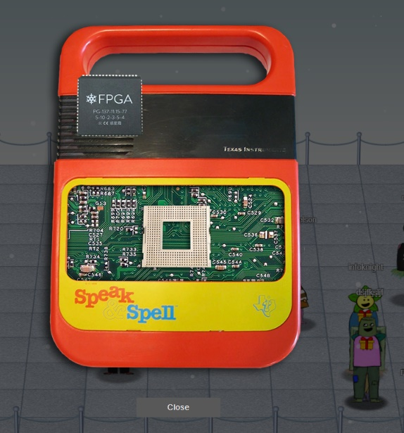
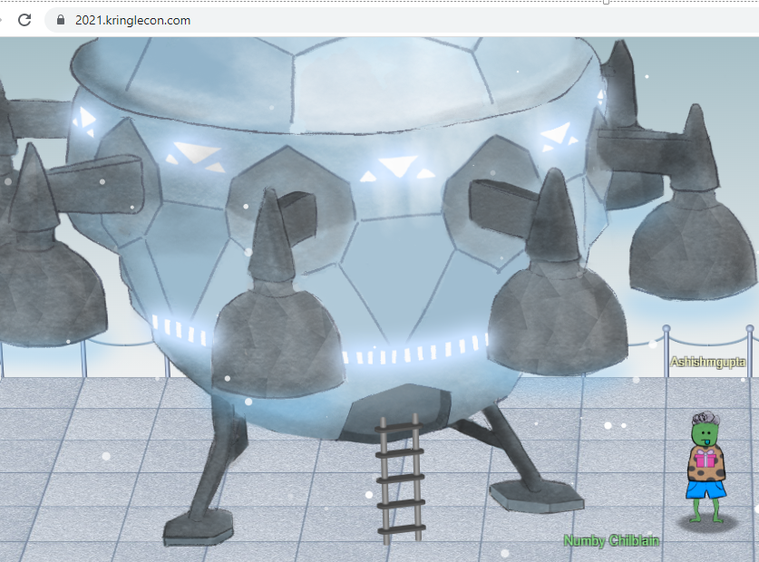
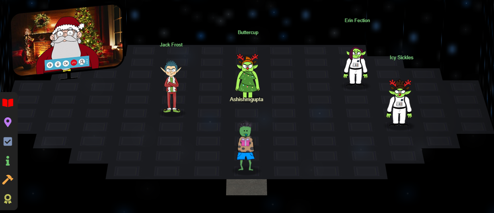
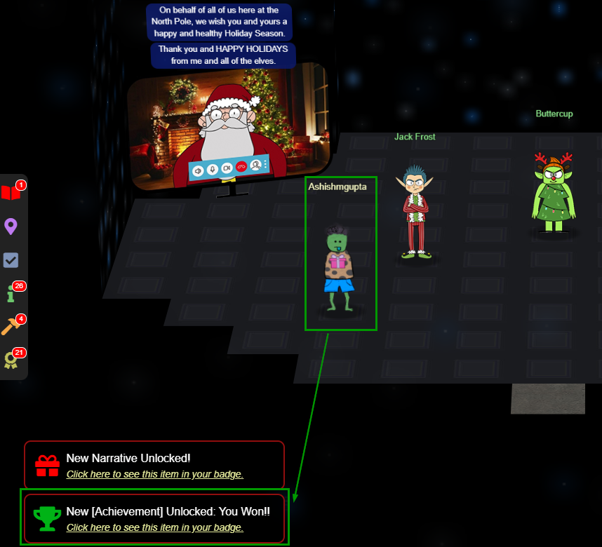

As a result of solving the objective# 12 FPGA programming, we have successfully programmed the FPFA chip.  
We put the FPGA on the spell-speak instrument.  

We immediately see a new achivement unlocked.  

A spaceship lands on the Jack’s tower roof top.  

We enter the spaceship and we are greeted by Santa, folks from the Frost Planet and of course, not so happy looknig Mr. Jack Frost.

We also get a message saying "You won"!!!  

