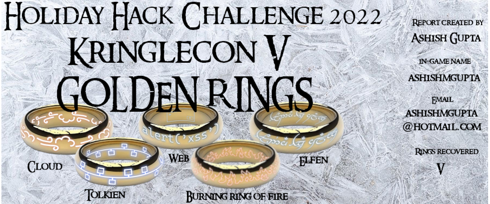

 
# Overview

Hello and welcome to my SANS Holiday Hack Challenge 2022 write-up. 
SANS Holiday Hack Challenge is a holiday themed and gamified cybersecurity competition.  
The hands-on challenges encompass a number of cyber security areas namely network security, application security, cloud security to name a few. 
This year the challenge is based on "Lord of the Rings" series.  You are tasked to recover 5 golden rings with each ring requiring you to solve several challenges.   Completing all the challenges also uncovers the whole story.
 You can read more about the challenge on SANS official website <a href="https://holidayhackchallenge.com/2020/" target=_blank>here.</a>

 Details on each objective can be accessed from left navigation </a>
  
 
<h1>Objectives completed </h1>
 
  
<h1>The uncovered story</h1>

<q><i>
  Five Rings for the Christmas king immersed in cold. 
  Each Ring now missing from its zone. 
  The first with bread kindly given, not sold. 
  Another to find 'ere pipelines get owned. 
  One beneath a fountain where water flowed. 
  Into clouds Grinchum had the fourth thrown. 
  The fifth on blockchains where shadows be bold. 
  One hunt to seek them all, five quests to find them. 
  One player to bring them all, and Santa Claus to bind them.
</i></q>

<!--table class=MsoTableGrid border=1 cellspacing=0 cellpadding=0 width=100%>
 <tr style='height:11.45pt'>
  <td valign=top>
  
<b>Objectives
  completed</b>

  </td>
  <td >
  
<b>The Story</b>

  </td>
 </tr>
 <tr style='height:244.2pt'>
  <td valign=top>
  
  </td>
  <td>
  
Five Rings for the Christmas king immersed in cold.

  
Each Ring now missing from its zone.

  
The first with bread kindly given, not sold.

  
Another to find 'ere pipelines get owned.

  
One beneath a fountain where water flowed.

  
Into clouds Grinchum had the fourth thrown.

  
The fifth on blockchains where shadows be bold.

  
One hunt to seek them all, five quests to find them.

  
One player to bring them all, and Santa Claus to bind
  them.

  </td>
 </tr>
</table-->

<!--img src="images/blog_images/banner.png" alt="drawing" width="1000px"/> 
# Overview

Hello and welcome to my SANS Holiday Hack Challenge 2022 write-up.

SANS Holiday Hack Challenge is a holiday themed and gamified cybersecurity competition.
 

The hands-on challenges encompass a number of cyber security areas namely network security, application security, cloud security to name a few.

It's my privilege to attend the Kringlecon for the third time. 

Since 2020, every year I look forward to December and make every attempt to complete it.

This year the challenge is based on "Lord of the Rings" series.  You are tasked to recover 5 golden rings with each ring requiring you to solve several challenges.   Completing all the challenges also uncover the whole story.

You can read more about the challenge on SANS official website <a href="https://holidayhackchallenge.com/2020/" target=_blank>here</a>

I was able to complete all of challenges and recover all the rings.

 Details on each objective can be accessed from left navigation </a>

  
<table class=MsoTableGrid border=1 cellspacing=0 cellpadding=0 width=100%>
 <tr style='height:11.45pt'>
  <td width=452 valign=top style='width:339.0pt;border:solid windowtext 1.0pt;
  padding:0in 5.4pt 0in 5.4pt;height:11.45pt'>
  
<b>Objectives
  completed</b>

  </td>
  <td width=346 valign=top style='width:259.45pt;border:solid windowtext 1.0pt;
  border-left:none;padding:0in 5.4pt 0in 5.4pt;height:11.45pt'>
  
<b>The Story</b>

  </td>
 </tr>
 <tr style='height:244.2pt'>
  <td width=452 valign=top style='width:339.0pt;border:solid windowtext 1.0pt;
  border-top:none;padding:0in 5.4pt 0in 5.4pt;height:244.2pt'>
  

  </td>
  <td width=346 valign=top style='width:259.45pt;border-top:none;border-left:
  none;border-bottom:solid windowtext 1.0pt;border-right:solid windowtext 1.0pt;
  padding:0in 5.4pt 0in 5.4pt;height:244.2pt'>
  
Five Rings for the Christmas king immersed in cold

  
Each Ring now missing from its zone

  
The first with bread kindly given, not sold

  
Another to find 'ere pipelines get owned

  
One beneath a fountain where water flowed

  
Into clouds Grinchum had the fourth thrown

  
The fifth on blockchains where shadows be bold

  
One hunt to seek them all, five quests to find them

  
One player to bring them all, and Santa Claus to bind
  them

  </td>
 </tr>
</table-->

