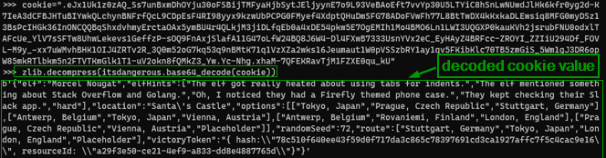
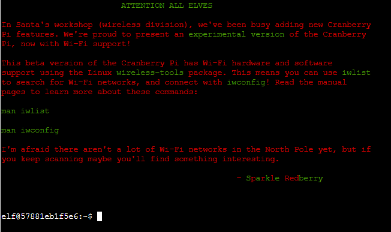
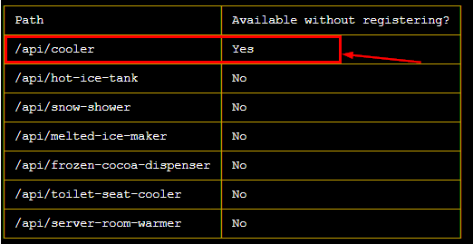
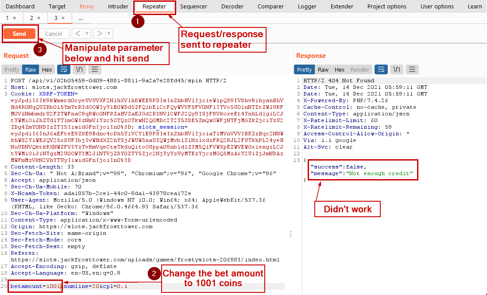
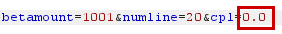
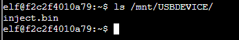

# SANS Holiday Hack Challenge 2021

## Overview
This document is a writeup of SANS holiday challenge 2021. This document has answers of all the objectives (total 13), high-level approach as well as details on how those answers were derived.

| Objective completed      | The story |
| ----------- | ------------------------------------ |
|      | Listen children to a story that was written in the cold<br> 'Bout a ringle and his castle hosting hackers, meek and bold<br> Then from somewhere came another, built his tower tall and proud<br> Surely, he, our Frosty villain hides intentions 'neath a shroud<br> So begins Jack's reckless mission: gather trolls to win a war<br> Build a con that's fresh and shiny, has his yet been done before?<br> Is his Fest more feint than folly? Some have noticed subtle clues<br> Running 'round and raiding repos, stealing Santa's Don'ts and Do's<br> Misdirected, scheming, grasping, Frost intends to seize the day<br> Funding research with a gift shop, can Frost build the better sleigh? <br>Lo, we find unlikely allies: trolls within Jack's own command<br> Doubting Frost and searching motive, questioning his dark demand<br> Is our Jack just lost and rotten - one more outlaw stomping toes?<br> Why then must we piece together cludgy, wacky radios?<br> With this object from the heavens, Frost must know his cover's blown<br> Hearkening from distant planet! We the heroes should have known<br> Go ahead and hack your neighbor, go ahead and phish a friend<br> Do it in the name of holidays, you can justify it at year's end<br> There won't be any retweets praising you, come disclosure day<br> But on the snowy evening after? Still Kris Kringle rides the sleigh |


## Answer to objectives and High-level approach

| Objectives      | Answers                          | High level approach                          |
| ----------- | ------------------------------------ |----------------------------------------------|
| <b>1.Kringlecon Orientation</b> | <b>answer</b> | Write “answer” in the top pane of the terminal presented by the elf Jingle Ringford.|
| <b>2.Where in the world is Carmel Santaigo?</b>      | <b>Solved in the game</b>                          | <b>OWASP Sensitive data exposure :</b><br> (In the flask cookie) Get the hints about the elf and their route info by decoding the flask cookie and use it in the game to follow and find the elf.                           |
| <b>3.Thaw Frost Tower's entrance</b>      | <b>Solved in the game</b>                          | <b>API Abuse :</b><br> Use the API http://nidus-setup:8080/api/cooler to increase the temperature of the thermostat to thaw the frozen entrance.|
| <b>4.Slot machine Investigation</b>      | <b>I'm going to have some bouncer trolls bounce you right out of this casino!| <b>API Abuse:</b><br>Manipulate the “numline” parameter sent to https://slots.jackfrosttower.com/ to increase the bet amount an exceed 1000 coins and reveal the answer.|
| <b>5.Strange USB Device</b>      | <b>ickymcgoop</b>                          | <b>USB Rubber Ducky :</b> <br> Use mallard.py to decode the encoded USB ducky script (/mnt/USBDEVICE/inject.bin). In the decoded value, find another reversed base64 value, reverse it and decode to find the user for whom an authorized_key file is getting created with the public cert.                          |
| <b>6.Shellcode Primer</b>      | <b>cyber security knowledge</b> | <b>Shell code :</b> <br> On Step 11) '/var/northpolesecrets.txt' <br> 1. Call sys_open to open the file <br> 2. Call sys_read to read the file using buffer (mov rsi, rsp) <br> 3. Call sys_write to write contents from rsp to stdout (Keep the count high e.g., 1000 so we can account for all contents in the file)|
| <b>7.Printer Exploitation</b>      | <b>Troll_Pay_Chart.xlsx</b> | <b>Hash Length extender attack :</b> <br> 1.Download the firmware, decode the firmware field from base64 to extract the zip file.<br> 2.Craft the payload to copy the name of last printed xlsx file to a new file and copy the file to /incoming folder.<br> 3.Use hash extender to append our payload zip to original zip file using hash and base64 encode the output. Create the JSON firmware from it.<br> 4. Upload the new JSON firmware to the portal.<br> 5. Download the file from /incoming folder which will have the name of the last printed .xlsx file.<br>|
| <b>8.Kerberoasting on an Open Fire</b>      | <b>Kindness</b>                          | <b>Kerberoasting and WriteDACL abuse :</b> <br>1.Get the two shared folders in the network using our user: elfu_svc_shr and research_dep<br>2.Kerberoasting attack to get TGS (Ticket granting service) hash for elfu_svc.<br>3.Use Hashcat to crack TGS hash for elfu_svc user.<br>4.Get hard coded creds for remote_elf embedded in PowerShell script which is stored in \elfu_svc_shr share.<br>5.PrivEsc – Use WriteDACL to add our low priv. user to AD group “Research Department”.<br>6.Access the secret document “SantaSecretToAWonderfulHolidaySeason.pdf” in the \reserach_dep to find the answer.<br>|
| <b>9.Splunk</b>      | <b>whiz</b>                          | Splunk queries on Sysmon and Github audit data <br>(Described in the relevant section below)|
| <b>10.Now Hiring</b> | <b>CGgQcSdERePvGgr058r3PObPq3+0CfraKcsLREpX</b> | <b>Server-Side Request Forgery (SSRF) on EC2 hosted website:</b> <br>1.Website has URL as an input in the “URL to your NLBI report” field.<br> 2.Send http://169.254.169.254/latest/meta-data/iam/security-credentials/ in the URL and see the name of IAM role (“jf-deploy-role”) attached to the EC2 instance returned in the response of the GET request of an image.<br> 3.Send http://169.254.169.254/latest/meta-data/iam/security-credentials/jf-deploy-role in the URL input and get the secret access key returned in the response of the GET request of an image.<br>|
| <b>11.Customer Complaint Analysis</b> | <b>Flud Hagg Yaqh</b> | <b>Packet Analysis using Wireshark for RFC 3514 compliance: </b><br>1.	From .pcap file, find the room number for the guest who is RFC 3514 non-compliant using ip.flags.rb == 0</br>2.From the .pcap file, find the trolls who are compliant (ip.flags.rb == 1) and complaining about the guest in the room number found in 1)
| <b>12. Frost Tower Website Checkup</b> | <b>Clerk</b> | <b>OWASP broken auth and SQL Injection attacks:</b> <br>1.Examine the source code<br>2.Broken auth: Exploit the /postcontact endpoint to log in and get access to the dashboard.<br>3.SQL Injection: Exploit the /detail endpoint to get additional table name (“todo”) and its column names.<br>4.Get data from table “todo” table having the job position for Santa.<br>|
| <b>13. FPGA Programming</b>      |        <b>TBD</b>                   |            TBD               |


<style>

</style>

## 1. Kringlecon Orientation
<!-- 
<table style="table-layout:fixed;overflow-wrap: break-word;width=100%" border="2">
  <tr>
    <td></td>
    <td>Entry</td>
    <td>Tangle Coalboxsssssssssssssssssssssssssssssssssssssssssssss</td>
  </tr>
 
</table>

| Header1 | header2 | header3 | header4  |
| ------- | ------- |---------|----------|
| Bar     | bar     | bar     | bar      |

|       | Entry                          | Tangle Coalbox|
| ----------- | ------------------------------------ |----------------------------------------------|
-->
Upon login on [https://2021.kringlecon.com](https://2021.kringlecon.com), we see Jingle Ringford guarding the entry asking below  <br>
>First things first, here's your badge! It's that wrapped present in the middle of your avatar.<br>
>Click on the badge on your avatar 🎁. <br>
That’s where you will see your Objectives, Hints, and gathered Items for the Holiday Hack Challenge.<br>
>We’ve also got handy links to the KringleCon talks and more there for you!<br>
>Next, click on that USB wifi adapter - just in case you need it later.


<table>
        <tr>
        <td></td>
        <td></td>
        </tr>
</table>


We pick up the Wi-Fi adapter.<br>
We click on the terminal to access it and then type “answer” in the upper pane of the terminal and the gate is opened.<br>

<table>
        <tr>
        <td></td>
        <td></td>
        </tr>
</table>

## 2. Where in the world is Carmel Santaigo

<table>
        <tr>
        <td></td>
        <td>
            <b>Hints from Tangle Coalbox</b><br>
            Turns out some elves have gone on some misdirected journeys around the globe. <br>
            It seems that someone is messing with their travel plans.<br>
            We could sure use your open-source intelligence (OSINT) skills to find them.<br>
            Why dontcha' log into this vintage Cranberry Pi terminal and see if you have what it takes to track them around the globe.<br>
            If you're having any trouble with it, <b>you might ask Piney Sappington right over there for tips</b>.<br>
        </td>
        </tr>
</table>
Tangle Coalbox indicates another elf named “Piney Sappington” may have some hints on how to solve this objective. <br>
So, we head over to that elf now who is also present in the courtyard.

<table>
        <tr>
        <td></td>
        <td>
            <b>Hints from Piney Sappington</b><br>
            You see, I've been looking at these documents, and I know someone has tampered with one file. <br>
            Do you think you could log into this Cranberry Pi and take a look?<br>
            It has exiftool installed on it, if that helps you at all.<br>
            I just... Well, I have a feeling that someone at that other conference might have fiddled with things.<br>
            And, if you help me figure this tampering issue out, I’ll give you some hints about OSINT, especially associated with geographic locations!<br>
        </td>
        </tr>
</table>

In the terminal we are presented with the below problem:<br>
>HELP! That wily jack Frost Modified one of our naughty/nice records, and right before Christmas! 
>Can you help us which one? We’ve installed exiftool for your convenience!


We will get the Last Modified By attribute value for all the docx files and then grep the output it with “Jack”. <br>
That should give us all the files which were last modified by Jack Frost. <br> 
We have -C 5 in the grep so we can get the lines around the matches for the context.

Command entry and output : <br>
<br>
Answer verification : <br>
<br>
Achivement Unlocked :<br>
<br>
Hint Unlocked :<br>


The “flask cookies” hint is actually a Github Gist from Mr. Chris Elgee. <br>
[https://gist.github.com/chriselgee/b9f1861dd9b99a8c1ed30066b25ff80b](https://gist.github.com/chriselgee/b9f1861dd9b99a8c1ed30066b25ff80b) <br>
That above gist shows how one can decode the value in a cookie generated by Flask applications. <br>

Going back to objective #2 we start the game.<br>
<br>
In the browser we open developer tools. <br>
Under developer tools > Application tab there is a cookie named "Cookiepella" for the domain used for the challenge (caramel.kringlecastle.com).<br>

 <br>

We follow the instructions to decode the value in the flask cookie to JSON.<br>

```python
cookie = "<value of the cookiepella cookie>"
import zlib; import itsdangerous
zlib.decompress(itsdangerous.base64_decode(cookie))
```
 <br>

We format the output JSON for better understanding.<br>
The JSON has details about the elf to identify them. <br>
The JSON has also has the route the elf took. We can take the same route to catch the elf. <br>
 <br>

On the visit interlink page, we supply data we have in the decoded flask cookie and click on "Filter Elves". <br>
 <br>

The elves have been filtered out based on the data and possibly Its Morcel Nougat and their location was "Santa's Castel"<br>
Both of these datapoints are also in the decoded cookie value.<br>

Note the route taken by the elf in the decoded cookie value:<br>
<b>Stuttgart, Germany > Tokyo, Japan > London, England > PlaceHolder</b><br>
We click on "Depart by sleigh" to follow the same route to catch up with the elf in London, England.<br>

<table>
        <tr>
            <td>In London, England, we notice there is no option to "Depart by Sleigh"<br>
                which indicates we are close to the elf. We click on Investigate.
            </td>
            <td>
            We are presented with 3 investigate options.<br>
            </td>
        <tr>
        <td>
        
        </td>
        <td>
            <br>
        </td>
        </tr>
</table>


When we click on "Investigate 1", It says we have caught up to the elf.<br>
We are given the option to guess the elf.<br>
We choose "Morcel Nouget" since Its also in the name of the elf in the decoded cookie.
 <br>

Upon selecting the elf and clicking on the “Guess Elf” <br>
The message "You've won" appears which means we have completed the challenge.<br>
<br>

## 3. Thaw Frost Tower Entrance

<table border=1px>
<tr>
    <td colspan=3>
    <b>Challenge : </b> <br>
    Turn up the heat to defrost the entrance to Frost Tower. <br>Click on the Items tab in your badge to find a link to the Wifi Dongle's CLI interface. Talk to Greasy Gopherguts outside the tower for tips
    </td>
</tr>
<tr>
    <td>
    <b>Difficulty Level : </b> <br>
    <br>
    </td>
    <td>
     <b>Location : </b> <br>
    Frost Tower Entrance
    </td>
    <td>
    <b>Elf/Troll : </b> <br>
    Grimy McTrollkins <br>
    </td>
</tr>
</table>
<table>
<tr>
    <td>
    
    </td>
    <td>
    <b> Hints from Grimy McTrollkins </b> <br>
    Yo, I'm Grimy McTrollkins. <br>
    I'm a troll and I work for the big guy over there: Jack Frost.<br>
    I’d rather not be bothered talking with you, but I’m kind of in a bind and need your help.<br>
    Jack Frost is so obsessed with icy cold that he accidentally froze shut the door to Frost Tower!<br>
    I wonder if you can help me get back in.<br>
    I think we can melt the door open if we can just get access to the thermostat inside the building.<br>
    That thermostat uses Wi-Fi. And I’ll bet you picked up a Wi-Fi adapter for your badge when you got to the North Pole.<br>
    Click on your badge and go to the Items tab. There, you should see your Wi-Fi Dongle and a button to “Open Wi-Fi CLI.” That’ll give you<br> command-line interface access to your badge’s wireless capabilities.<br>
    </td>
<tr>
</table>

Click on the badge and go to the Items tab. There, we see the Wi-Fi Dongle and a button to “Open Wi-Fi CLI.” <br>
That gives us command-line interface access to wireless capabilities.<br>

<table>
<tr>
    <td>
    
    </td>
    <td>
    
    </td>
<tr>
</table>


Scan for any available the ESSIDs  <br>
```bash
iwlist wlan0 scanning 
```


We find an ESSID named “FROST-Nidus-Setup”. <br>
Now we connect to “FROST-Nidus-Setup” ESSID.
```bash
iwconfig wlan0 essid FROST-Nidus-Setup
```


Connection succecssful to the ESSID. <br>
Issue a curl command to http://nidus-setup:8080. <br>

```bash
curl http://nidus-setup:8080
```


Looks like few APIs are hosted there. <br>
Access the API docs <br>
Note the /api/cooler does not need registration <br>
```bash
curl http://nidus-setup:8080/apidoc
```


Following the documentation, we make use of /cooler endpoint passing a temperature which may melt ice e.g., 110 degrees <br>

```bash
curl -XPOST -H 'Content-Type: application/json' \
  --data-binary '{"temperature": 110}' \
  http://nidus-setup:8080/api/cooler
```


The jack frost tower entrance is now open and the objective is now completed. <br>

<table>
<tr>
    <td>
    
    </td>
    
    
    </td>
<tr>
</table>


## 4. Slot Machine Investigation
<table border=1px>
<tr>
    <td colspan=3>
    <b>Challenge : </b> <br>
    Test the security of Jack Frost's slot machines. <br> 
    What does the Jack Frost Tower casino security team threaten to do when your coin total exceeds 1000? 
    Submit the string in the server data.response element. <br>
    Talk to Noel Boetie outside Santa's Castle for help.
    </td>
</tr>
<tr>
    <td>
    <b>Difficulty Level : </b> <br>
    <br>
    </td>
    <td>
     <b>Location : </b> <br>
    Frost Tower Lobby
    </td>
    <td>
    <b>Elf/Troll : </b> <br>
    Hubris Selfington <br>
    </td>
</tr>
</table>

<table>
<tr>
    <td>
    
    </td>
    <td>
    <b> Hints from Hubris Selfington </b> <br>
    The big boss told me he’s worried about vulnerabilities in his slot machines, especially this one.<br>
    Statistically speaking, it seems to be paying out way too much.<br>
    He asked me to see if there are any security flaws in it.<br>
    The boss has HUGE plans and we’ve gotta make sure we are running a tight ship here at Frost Tower.<br>
    <b>Hint:</b><br>
    The objective states “Submit the string in the server data. response element”
    </td>
<tr>
</table>

Clicking on the slot machine behind the troll opens <a href="https://slots.jackfrosttower.com" target=_blank>https://slots.jackfrosttower.com</a> where we can click “Play game” to open the game.
<table>
<tr>
    <td>
    
    </td>
    <td>
    
    </td>
<tr>
</table>

We open Burp Suite and capture traffic for only slots.jackfrosttower.com. <br>
Click "Spin" in the bottom right corner. <br>


Burp intercepts the requests and shows a POST request to the /api/v1/<guid>/spin with three parameters: <br> 
<ol>
    <li>betamount</li>
    <li>numline</li>
    <li>cpl</li>
</ol>


We investigate with repeater, sending 1001 to the betamount parameter and It does not work. <br>


Keeping the betamount parameter as 1001 (because we need to bet with >1000 coins), we manipulate the other two parameters, numline and cpl, send them to the API to see if we are successful.


<table>
<tr>
    <th>Manipulating parameter values</th>
    <th>Request</th>
    <th>Response</th>
</tr>
<tr>
    <td>
    Decrease cpl to 0.0
    </td>
    <td>
    
    </td>
    <td>
    
    </td>
<tr>
<tr>
    <td>
    Increase cpl to 0.2
    </td>
    <td>
    
    </td>
    <td>
    
    </td>
<tr>
<tr>
    <td>
    Decrease numline to 10
    </td>
    <td>
    
    </td>
    <td>
    
    </td>
<tr>
<tr>
    <td>
    Increase numline to 30
    </td>
    <td>
    
    </td>
    <td>
    
    </td>
<tr>
<tr>
    <td>
    Make numline a negative number
    </td>
    <td>
    
    </td>
    <td>
    
    </td>
<tr>
</table>

Full request and response showing sending a negative value in the numline parameter would show a message in a new field named "response". <br>


The successful response shown below : <br>


data.response :  
<b>I'm going to have some bouncer trolls bounce you right out of this casino!</b> <br>

We submit the highlighted as the answer for the Slot Machine Investigation objective and its accepted!<br>


## 5. Strange USB device

<table border=1px>
<tr>
    <td colspan=3>
    <b>Challenge : </b> <br>
    Assist the elves in reverse engineering the strange USB device. Visit Santa's Talks Floor and hit up Jewel Loggins for advice.
    </td>
</tr>
<tr>
    <td>
    <b>Difficulty Level : </b> <br>
    <br>
    </td>
    <td>
     <b>Location : </b> <br>
    Santa’s talk floor 
    </td>
    <td>
    <b>Elf/Troll : </b> <br>
    Morcel Nougat <br>
    </td>
</tr>
</table>

<table>
<tr>
    <td>
    
    </td>
    <td>
    <b> Hints from Morcel Nougat : </b> <br>
        Do you know anything about USB Rubber Duckies?
        I've been playing around with them a bit myself.<br>
        Please see what you can do to help solve the Rubber Ducky Objective!<br>

        <b>Reference</b><br>
        Talk by Kevin Tyers  <br>
        <a href="https://www.youtube.com/watch?v=tkAYncGF-zw" target="_blank">HIDden Duckey, Deconstructed Payload</a>
    </td>
<tr>
</table>

We open the terminal and presented with a question <br>
Question: What is the troll username involved with this attack. <br>


We see there is an inject.bin under /mnt/USBDEVICE <br>


We do the file listing and we see a python file named “mallard.py”. <br>
If we look at the contents of the file, we see the python script takes an "inject.bin" file as an input


We run the mallard.py with the inject.bin as input.
```python
python ./mallard.py --file /mnt/USBDEVICE/inject.bin
```
The rubber ducky binary inject.bin is decoded.
We see a few interesting things being done in the original file. Numbered in the screenshot below :

<ol>
<li>There is a hardcoded base 64 string which looks like reversed ("==" in the front)</li>
<li>The "rev" used to reverse the already reversed base64 string making it a proper base64 string.</li>
<li>"base64" command with -d switch to decode the base64 string </li>
</ol>


So we take the above line from the source code  and execute in the terminal <br>
The base64 is reversed and decoded to reveal the user’s name.


In the above an authorized_key file is getting created with the public cert for the user <b>ickymcgoop</b>.
 The answer is <b>ickymcgoop</b> <br>

We submit that username as the answer. 


The answer gets accepted and we complete this objective.


## 6. Shell Code Primer
## 7. Printer Exploitation
## 8. Kerberoasting on an Open Fire
## 9. Splunk
## 10. Now Hiring 
## 11. Customer Complaint Analysis
## 12. Frost Tower Website Checkup
## 13. FPGA Programming


* `mkdocs new [dir-name]` - Create a new project.
* `mkdocs serve` - Start the live-reloading docs server.
* `mkdocs build` - Build the documentation site.
* `mkdocs -h` - Print help message and exit.


    mkdocs.yml    # The configuration file.
    docs/
        index.md  # The documentation homepage.
        ...       # Other markdown pages, images and other files.
