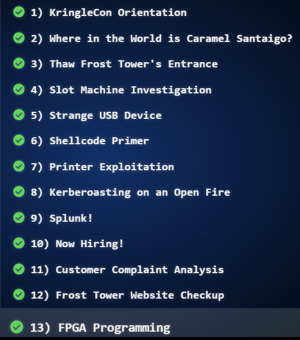
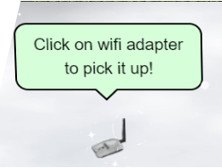

# SANS Holiday Hack Challenge 2021

## Overview
This document is a writeup of SANS holiday challenge 2021. This document has answers of all the objectives (total 13), high-level approach as well as details on how those answers were derived.

| Objective completed      | The story |
| ----------- | ------------------------------------ |
|      | Listen children to a story that was written in the cold  'Bout a ringle and his castle hosting hackers, meek and bold  Then from somewhere came another, built his tower tall and proud  Surely, he, our Frosty villain hides intentions 'neath a shroud  So begins Jack's reckless mission: gather trolls to win a war  Build a con that's fresh and shiny, has his yet been done before?  Is his Fest more feint than folly? Some have noticed subtle clues  Running 'round and raiding repos, stealing Santa's Don'ts and Do's  Misdirected, scheming, grasping, Frost intends to seize the day  Funding research with a gift shop, can Frost build the better sleigh?  Lo, we find unlikely allies: trolls within Jack's own command  Doubting Frost and searching motive, questioning his dark demand  Is our Jack just lost and rotten - one more outlaw stomping toes?  Why then must we piece together cludgy, wacky radios?  With this object from the heavens, Frost must know his cover's blown  Hearkening from distant planet! We the heroes should have known  Go ahead and hack your neighbor, go ahead and phish a friend  Do it in the name of holidays, you can justify it at year's end  There won't be any retweets praising you, come disclosure day  But on the snowy evening after? Still Kris Kringle rides the sleigh |

## Answer to objectives and High-level approach

| Objectives      | Answers                          | High level approach                          |
| ----------- | ------------------------------------ |----------------------------------------------|
| <b>1.Kringlecon Orientation</b> | <b>answer</b> | Write “answer” in the top pane of the terminal presented by the elf Jingle Ringford.|
| <b>2.Where in the world is Carmel Santaigo?</b>      | <b>Solved in the game</b>                          | <b>OWASP Sensitive data exposure :</b>  (In the flask cookie) Get the hints about the elf and their route info by decoding the flask cookie and use it in the game to follow and find the elf.                           |
| <b>3.Thaw Frost Tower's entrance</b>      | <b>Solved in the game</b>                          | <b>API Abuse :</b>  Use the API http://nidus-setup:8080/api/cooler to increase the temperature of the thermostat to thaw the frozen entrance.|
| <b>4.Slot machine Investigation</b>      | <b>I'm going to have some bouncer trolls bounce you right out of this casino!| <b>API Abuse:</b> Manipulate the “numline” parameter sent to https://slots.jackfrosttower.com/ to increase the bet amount an exceed 1000 coins and reveal the answer.|
| <b>5.Strange USB Device</b>      | <b>ickymcgoop</b>                          | <b>USB Rubber Ducky :</b>   Use mallard.py to decode the encoded USB ducky script (/mnt/USBDEVICE/inject.bin). In the decoded value, find another reversed base64 value, reverse it and decode to find the user for whom an authorized_key file is getting created with the public cert.                          |
| <b>6.Shellcode Primer</b>      | <b>cyber security knowledge</b> | <b>Shell code :</b>   On Step 11) '/var/northpolesecrets.txt'   1. Call sys_open to open the file   2. Call sys_read to read the file using buffer (mov rsi, rsp)   3. Call sys_write to write contents from rsp to stdout (Keep the count high e.g., 1000 so we can account for all contents in the file)|
| <b>7.Printer Exploitation</b>      | <b>Troll_Pay_Chart.xlsx</b> | <b>Hash Length extender attack :</b>   1.Download the firmware, decode the firmware field from base64 to extract the zip file.  2.Craft the payload to copy the name of last printed xlsx file to a new file and copy the file to /incoming folder.  3.Use hash extender to append our payload zip to original zip file using hash and base64 encode the output. Create the JSON firmware from it.  4. Upload the new JSON firmware to the portal.  5. Download the file from /incoming folder which will have the name of the last printed .xlsx file. |
| <b>8.Kerberoasting on an Open Fire</b>      | <b>Kindness</b>                          | <b>Kerberoasting and WriteDACL abuse :</b>  1.Get the two shared folders in the network using our user: elfu_svc_shr and research_dep 2.Kerberoasting attack to get TGS (Ticket granting service) hash for elfu_svc. 3.Use Hashcat to crack TGS hash for elfu_svc user. 4.Get hard coded creds for remote_elf embedded in PowerShell script which is stored in \elfu_svc_shr share. 5.PrivEsc – Use WriteDACL to add our low priv. user to AD group “Research Department”. 6.Access the secret document “SantaSecretToAWonderfulHolidaySeason.pdf” in the \reserach_dep to find the answer. |
| <b>9.Splunk</b>      | <b>whiz</b>                          | Splunk queries on Sysmon and Github audit data  (Described in the relevant section below)|
| <b>10.Now Hiring</b> | <b>CGgQcSdERePvGgr058r3PObPq3+0CfraKcsLREpX</b> | <b>Server-Side Request Forgery (SSRF) on EC2 hosted website:</b>  1.Website has URL as an input in the “URL to your NLBI report” field.  2.Send http://169.254.169.254/latest/meta-data/iam/security-credentials/ in the URL and see the name of IAM role (“jf-deploy-role”) attached to the EC2 instance returned in the response of the GET request of an image.  3.Send http://169.254.169.254/latest/meta-data/iam/security-credentials/jf-deploy-role in the URL input and get the secret access key returned in the response of the GET request of an image. |
| <b>11.Customer Complaint Analysis</b> | <b>Flud Hagg Yaqh</b> | <b>Packet Analysis using Wireshark for RFC 3514 compliance: </b> 1.	From .pcap file, find the room number for the guest who is RFC 3514 non-compliant using ip.flags.rb == 0 2.From the .pcap file, find the trolls who are compliant (ip.flags.rb == 1) and complaining about the guest in the room number found in 1)
| <b>12. Frost Tower Website Checkup</b> | <b>Clerk</b> | <b>OWASP broken auth and SQL Injection attacks:</b>  1.Examine the source code 2.Broken auth: Exploit the /postcontact endpoint to log in and get access to the dashboard. 3.SQL Injection: Exploit the /detail endpoint to get additional table name (“todo”) and its column names. 4.Get data from table “todo” table having the job position for Santa. |
| <b>13. FPGA Programming</b>      |        <b>TBD</b>                   |            TBD               |

## 1. Kringlecon Orientation
<table style="table-layout:fixed;overflow-wrap: break-word;width=100%" border="2">
  <tr>
    <td></td>
    <td>Entry</td>
    <td>Tangle Coalboxsssssssssssssssssssssssssssssssssssssssssssss</td>
  </tr>
 
</table>

| Header1 | header2 | header3 | header4  |
| ------- | ------- |---------|----------|
| Bar     | bar     | bar     | bar      |

|       | Entry                          | Tangle Coalbox|
| ----------- | ------------------------------------ |----------------------------------------------|

Upon login on [https://2021.kringlecon.com](https://2021.kringlecon.com), we see Jingle Ringford guarding the entry asking below   
>First things first, here's your badge! It's that wrapped present in the middle of your avatar. 
>Click on the badge on your avatar 🎁.  
That’s where you will see your Objectives, Hints, and gathered Items for the Holiday Hack Challenge. 
>We’ve also got handy links to the KringleCon talks and more there for you! 
>Next, click on that USB wifi adapter - just in case you need it later.

<table>
        <tr>
        <td></td>
        <td></td>
        </tr>
</table>

We pick up the Wi-Fi adapter. 
We click on the terminal to access it and then type “answer” in the upper pane of the terminal and the gate is opened. 

<table>
        <tr>
        <td></td>
        <td></td>
        </tr>
</table>

## 2. Where in the world is Carmel Santaigo
## 3. Thaw Frost Tower Entrance
## 4. Slot Machine Investigation
## 5. Strange USB device
## 6. Shell Code Primer
## 7. Printer Exploitation
## 8. Kerberoasting on an Open Fire
## 9. Splunk
## 10. Now Hiring 
## 11. Customer Complaint Analysis
## 12. Frost Tower Website Checkup
## 13. FPGA Programming

* `mkdocs new [dir-name]` - Create a new project.
* `mkdocs serve` - Start the live-reloading docs server.
* `mkdocs build` - Build the documentation site.
* `mkdocs -h` - Print help message and exit.

    mkdocs.yml    # The configuration file.
    docs/
        index.md  # The documentation homepage.
        ...       # Other markdown pages, images and other files.
